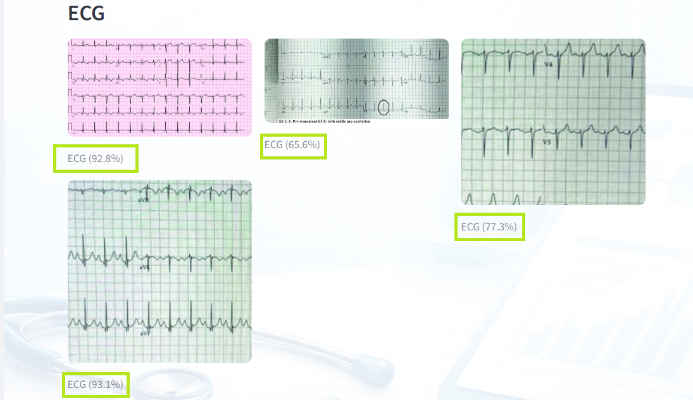
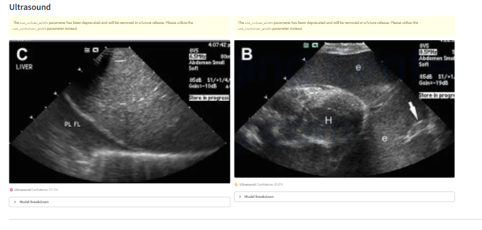

<h1 align="center", color='red'>MedScan</h1>

<strong>Multimodal Medical Report Analyzer</strong>

System for analyzing medical PDF reports

---

## Overview

MedScan is a multimodal system designed to explore how medical reports in PDF format can be systematically analyzed using a combination of classical processing techniques, deep learning, and large language models.

The system focuses on **understanding report structure**, not on diagnosing diseases. It extracts text, tables, and images from medical PDFs, classifies embedded medical images by modality, reconstructs laboratory tables commonly used in Indian reports, and produces structured JSON outputs.

On top of this structured representation, MedScan generates **patient-friendly** and **clinician-oriented** summaries to demonstrate explainability workflows.

> **Note**  
> This project is built as a learning and experimentation platform and is **not** a clinical product.

---

## Demo

**X-ray Report Walkthrough**  
https://github.com/user-attachments/assets/f0b17373-b9ce-4b72-8698-d4ca2b6c40be

**Laboratory Report Walkthrough**  
https://github.com/user-attachments/assets/8c96c6b8-26f1-4347-8755-8633fa6e787f

---

## Screenshots

### Image Classification

**ECG Classification**

**X-ray Classification**

**Ultrasound Classification**

---

### LLM Summaries

**X-ray – Clinical Summary**

**X-ray – Patient Summary**

**Lab Report – Clinical Summary**

**Lab Report – Patient Summary**

---

### Lab Table Extraction

**Cleaned table with low and normal flags**

---

## What MedScan Can Do

- Accept medical PDFs such as lab reports and imaging reports  
- Detect whether a PDF is digitally generated or scanned  
- Extract:
  - free text
  - tabular data
  - embedded medical images  
- Classify extracted images into:
  - CT
  - MRI
  - X-ray
  - Ultrasound
  - ECG
  - Non-medical  
- Parse Indian laboratory reports including CBC and Widal panels  
- Convert unstructured content into a clean, structured JSON schema  
- Generate:
  - patient-friendly explanations
  - clinician-focused technical summaries  

---

## Pipeline

At a high level, the system follows this flow:

1. **PDF ingestion**  
   The input PDF is analyzed to determine whether pages are scanned or digitally generated.

2. **Text, table, and image extraction**  
   - Digital PDFs are parsed directly  
   - Scanned PDFs use OCR-based fallbacks  
   - Tables are extracted using structure-aware methods or reconstructed from raw text  

3. **Image modality classification**  
   Extracted images are normalized and passed through dedicated binary classifiers to identify the most likely medical modality.

4. **Hybrid report parsing**  
   Text content is segmented into logical sections such as patient information, findings, diagnosis, and recommendations.

5. **Structured JSON generation**  
   All extracted signals are unified into a single machine-readable representation.

6. **LLM-based explanation layer**  
   The structured JSON is transformed into readable summaries without allowing the language model to invent medical facts.

## Code Organization

- `src/` contains the complete application logic, including PDF processing, table extraction, image handling, report parsing, and summary generation.
- `image_classification_model/` stores trained image classification model weights used during inference.
- `requirements.txt` lists Python dependencies required to run the pipeline.

**The src directory contains all production logic, while trained model weights are stored separately to keep responsibilities clear.**

# External Software & System Dependencies

In addition to Python libraries listed in requirements.txt, MedScan relies on several external tools that must be installed at the system level for full functionality.
These tools are required mainly for handling scanned PDFs, image-based text extraction, and table reconstruction.
1) Tesseract OCR  -> Tesseract is used for optical character recognition when processing scanned PDFs or image-based lab reports. After installation, ensure the tesseract executable is available in your system PATH so it can be called by pytesseract.
2) Poppler -> Poppler provides command-line utilities used by pdf2image to convert PDF pages into images. On Windows, Poppler must be downloaded separately and added to the PATH.
3) Python Environment -> Python version: 3.9 or newer recommended. Virtual environments are strongly encouraged to isolate dependencies.

# -> Running the Application

cd src
streamlit run app.py
(-> The interface allows users to upload a medical PDF and observe each stage of the pipeline, including intermediate outputs and final summaries <-)

# Future Work

- Replacing the current rule-based sentence classification with transformer-based models fine-tuned for medical report section tagging
- Adding confidence calibration, uncertainty estimation, and error analysis tools across the pipeline
- Extending the image pipeline beyond modality classification by exploring image-level finding detection and disease pattern recognition as a separate module.

---

## Final Notes
MedScan is an ongoing learning and research project developed to explore multimodal medical report analysis using a combination of traditional processing techniques, deep learning, and large language models.
The repository is shared to document design decisions, experimentation, and system-level thinking rather than to present a finished clinical product. Feedback, discussions, and research-oriented contributions are welcome.
If you are reviewing this project as part of an academic, learning, or portfolio context, feel free to reach out for clarification on design choices or future directions.

